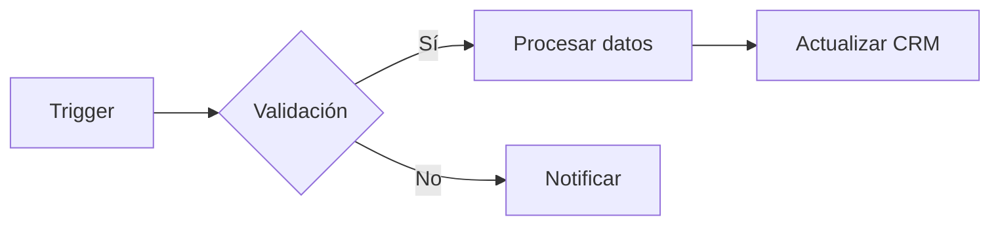

<Tag value="n8n" /> <Tag value="automatizacion" />

n8n es una plataforma de automatización visual que permite orquestar flujos entre APIs, bases de datos y servicios internos.

## Patrones recomendados

1. **Normaliza entradas** con nodos *Function* para asegurar consistencia.
2. **Controla errores** implementando rutas alternativas con nodos *IF*.
3. **Versiona tus flujos** exportando cada iteración al repositorio de procesos.

## Recursos

- [Documentación oficial](https://docs.n8n.io/)
- [Plantillas internas](https://tropica.notion.site)
